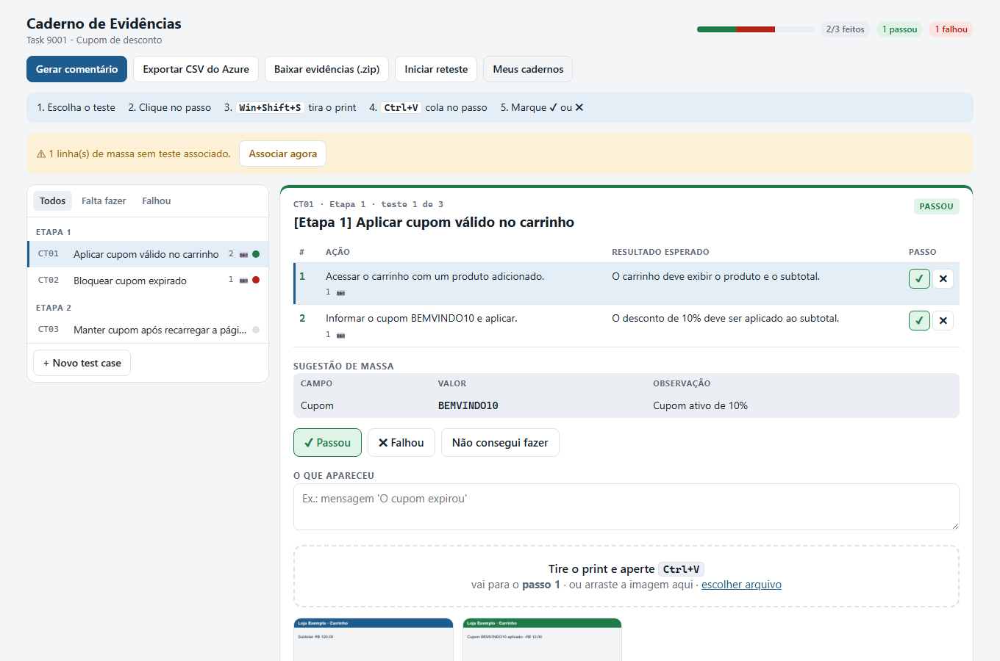
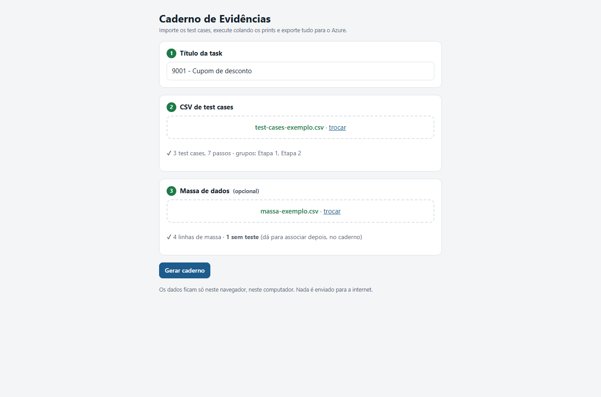
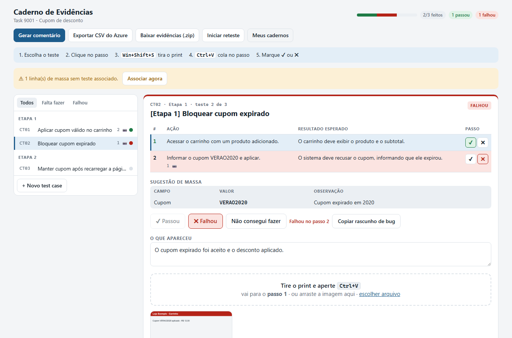
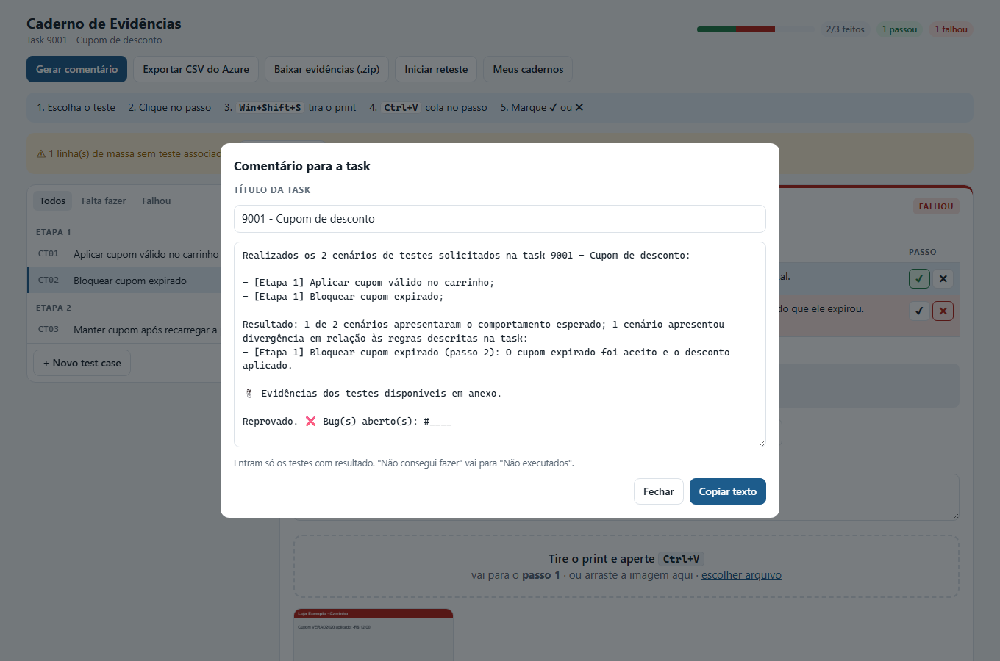

# Caderno de Evidências

Ferramenta para QA executar test cases do **Azure Test Plans** e coletar evidências
sem sair do navegador: importa os casos de teste, recebe os prints colados com
`Ctrl+V` direto no passo que está sendo executado e exporta tudo pronto para o Azure.

Roda **offline**, num único arquivo HTML, e nenhum dado sai do computador.



## O problema

O processo manual de evidência de teste era assim:

1. tirar o print de cada passo;
2. colar num documento do Word, tentando lembrar a qual teste e passo ele pertence;
3. escrever o comentário de aprovação ou reprovação da task;
4. subir os prints no Azure, um por um.

É um trabalho repetitivo, fácil de errar (print no teste errado, nome sem padrão)
e que interrompe a execução a cada passo.

## A solução

| Antes | Com o caderno |
| --- | --- |
| Colar print no Word e renomear na mão | `Ctrl+V` cai no passo ativo, com o nome `CT03_P2_01.png` |
| Controlar em planilha o que passou | ✔ ou ✖ em cada passo; um ✖ reprova o teste e mostra qual passo |
| Escrever o comentário da task | Gerado no padrão do time, pronto para colar |
| Juntar e subir os prints | Um `.zip` com os prints nomeados e um `resumo.html` |
| Procurar a massa de cada teste | A sugestão de massa aparece embaixo dos passos |
| Destacar o erro num editor de imagem | **Anotar**: retângulo ou seta em vermelho, guardando a original |
| Refazer o documento no reteste | O caderno fica salvo; **Iniciar reteste** reabre só o que falhou |

O programa **não usa IA**. Os test cases já chegam prontos (em CSV) de outra
ferramenta. Aqui eles são só organizados, executados e exportados.

## Como usar

1. Abra `dist/index.html` no navegador (duplo clique).
2. Cole o **título da task**, escolha o **CSV de test cases** e, se tiver, o **arquivo de massa**.
3. Para cada teste: clique no passo, tire o print (`Win+Shift+S`), cole (`Ctrl+V`) e marque ✔ ou ✖.
4. Exporte: **Gerar comentário**, **Exportar CSV do Azure** e **Baixar evidências (.zip)**.
5. Para retestar depois da correção: abra o caderno em **Meus cadernos** e clique em
   **Iniciar reteste**. Os testes escolhidos (por padrão, só os que falharam) voltam
   para "A fazer"; o resultado e os prints da rodada anterior continuam no caderno, e os
   prints novos saem com a rodada no nome (`CT03_R2_P2_01.png`).

| Tela inicial | Teste com falha | Comentário da task |
| --- | --- | --- |
|  |  |  |

### Entradas

**CSV de test cases** (obrigatório): o formato de importação do Azure Test Plans.

```csv
ID,Work Item Type,Title,Test Step,Step Action,Step Expected,Area Path,Assigned To,State
,Test Case,[Etapa 1] Bloquear cupom expirado,1,Acessar o carrinho.,O carrinho deve abrir.,Loja Exemplo\Checkout,Pessoa QA,Design
,,,2,Informar o cupom VERAO2020.,"O sistema deve recusar o cupom, informando que ele expirou.",,,
```

- A linha `Test Case` abre um teste; as linhas seguintes com `Title` vazio são os passos dele.
- Cada teste ganha um ID interno curto: `CT01`, `CT02`...
- Um prefixo como `[Etapa 1]` no título vira um grupo na lista.

**Massa de dados** (opcional): CSV ou JSON com `teste, campo, valor, observacao`.
A coluna `teste` aceita o ID interno (`CT03`) ou o título exato. O que não bater
pode ser associado na tela.

Exemplos fictícios em [`exemplos/`](exemplos/).

### Saídas

- **CSV para o Azure Test Plans**: o mesmo formato da entrada. Sem edição, o arquivo
  sai **idêntico byte a byte** ao importado. Com edição, entram os títulos e passos alterados.
- **Comentário da task**: aprovação ou reprovação, com os testes que falharam e os não executados.
- **Pacote `.zip`**: prints nomeados, `resumo.html` e `comentario.txt`.
- **Rascunho de bug**: para um teste que falhou, texto pronto com passos, esperado e obtido.

O resultado da execução (passou/falhou) fica só no caderno e no comentário. Ele não
é enviado ao Azure.

## Decisões técnicas

| Decisão | Motivo |
| --- | --- |
| **TypeScript + Vite + `vite-plugin-singlefile`** | Os tipos descrevem o formato dos dados (test case, passo, evidência) e acusam erro antes de rodar. O build junta tudo num único `index.html`, que abre com duplo clique: o navegador bloqueia scripts em módulos separados quando a página vem do disco (`file://`). |
| **IndexedDB** | Guarda os cadernos e as imagens (Blob) no próprio navegador. Um registro por print, para não regravar todas as imagens a cada tecla. O banco tem versão e migração: o formato antigo (um caderno só) é convertido sem perder prints, e há um teste que cria um banco antigo de verdade para conferir. |
| **Anotação guarda a original** | Evidência não deve perder o registro bruto. A imagem anotada vira o print, mas a colada fica guardada e pode ser restaurada. |
| **Reteste por rodadas no mesmo caderno** | O histórico de cada teste (rodada, resultado, passo que falhou) e os prints antigos ficam juntos, em vez de espalhados em documentos diferentes. |
| **PapaParse para ler o CSV** | Campos com vírgula vêm entre aspas; `split(",")` quebraria esses campos. |
| **Exportação a partir das linhas originais** | Cada linha exportada parte da linha importada, e só as colunas controladas são reescritas. O BOM, a quebra de linha (CRLF) e as aspas do original são preservados. |
| **Ler o arquivo sem `File.text()`** | `File.text()` remove o BOM em silêncio. Um teste de ponta a ponta pegou isso: a exportação deixava de sair idêntica no navegador, embora os testes unitários passassem. |
| **Regras separadas da tela** | Importar, exportar, gerar o comentário e montar o `.zip` são funções puras em `src/importar` e `src/exportar`, testadas sem navegador. |
| **Sem fontes nem scripts externos** | Nada é baixado da rede: os prints são dados da empresa. |

## Rodando o projeto

Requer Node 22.18 ou mais novo.

```bash
npm install
npm run dev          # desenvolvimento, com recarga automática
npm run build        # gera dist/index.html (um arquivo só)
npm test             # tipos + testes unitários + testes de ponta a ponta
npm run docs:prints  # regera as imagens deste README a partir dos exemplos
```

### Testes

- **Unitários** (`node:test`, em `tests/unit`): importação do CSV e da massa, exportação
  idêntica (com os exemplos e, se existir, com um arquivo real em `dados/`), comentário,
  nomes dos prints, pacote `.zip` e rascunho de bug.
- **Ponta a ponta** (Playwright, em `tests/e2e`): abrem o `dist/index.html` por `file://`,
  como no uso real, e cobrem importar CSV, colar print, marcar status, exportar o CSV
  idêntico, editar, baixar o `.zip`, vários cadernos, reteste, migração do banco antigo
  e anotação (desenhando com o mouse e conferindo o pixel da imagem salva).

## Estrutura

```
src/
  modelo.ts              tipos: Caderno, TestCase, Passo, Evidencia, LinhaMassa
  importar/              CSV do Azure e massa
  exportar/              CSV do Azure, comentário, nomes, pacote .zip, rascunho de bug
  reteste.ts             nova rodada: o que volta para "A fazer" e o histórico
  armazenamento/db.ts    IndexedDB (versões e migração)
  tela/                  tela inicial, caderno e anotação
exemplos/                dados fictícios
dados/                   arquivos reais (ignorado pelo git)
tests/unit, tests/e2e
```

## Privacidade

Os dados ficam só no navegador em que os cadernos foram abertos. Outro navegador ou
outro computador não vê o caderno. A pasta `dados/` e arquivos `.zip` estão no
`.gitignore`, para que arquivos reais nunca sejam versionados.

## Próximos passos

- **Fase 3**: integração com a API REST do Azure DevOps (criar test cases, postar o
  comentário, anexar evidências). Depende de autorização para usar um token pessoal (PAT).
